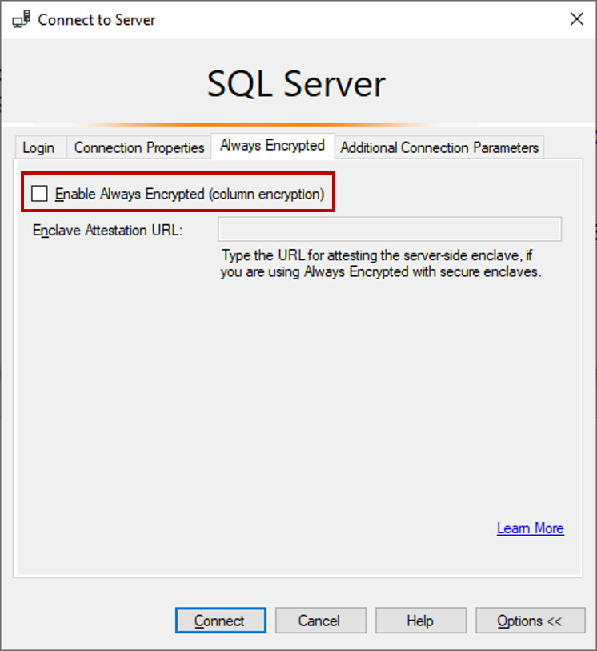
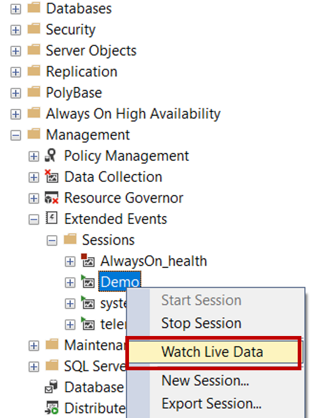
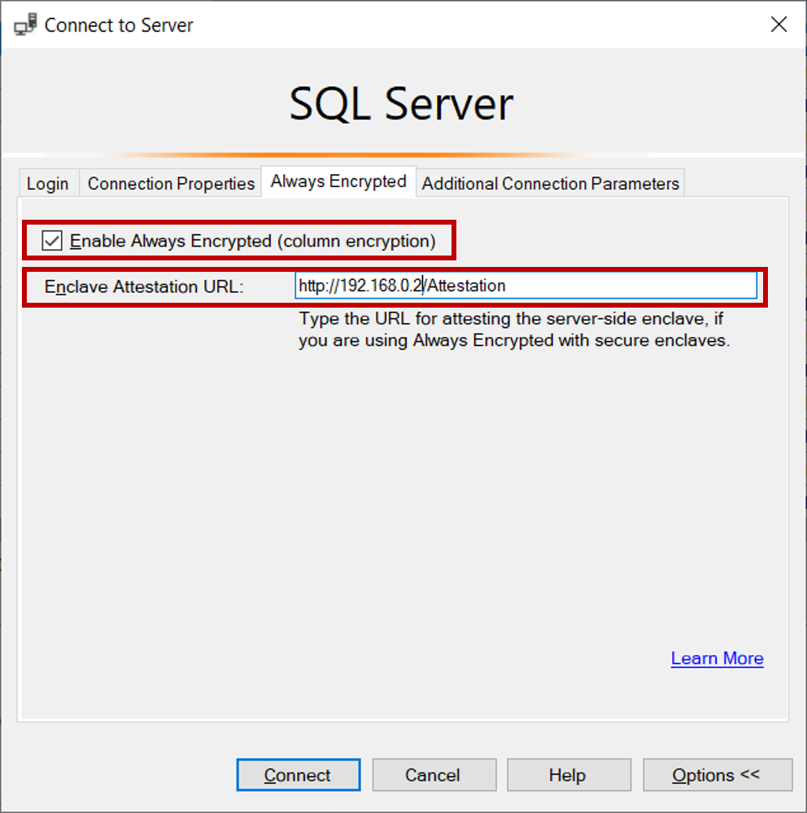
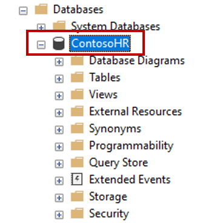
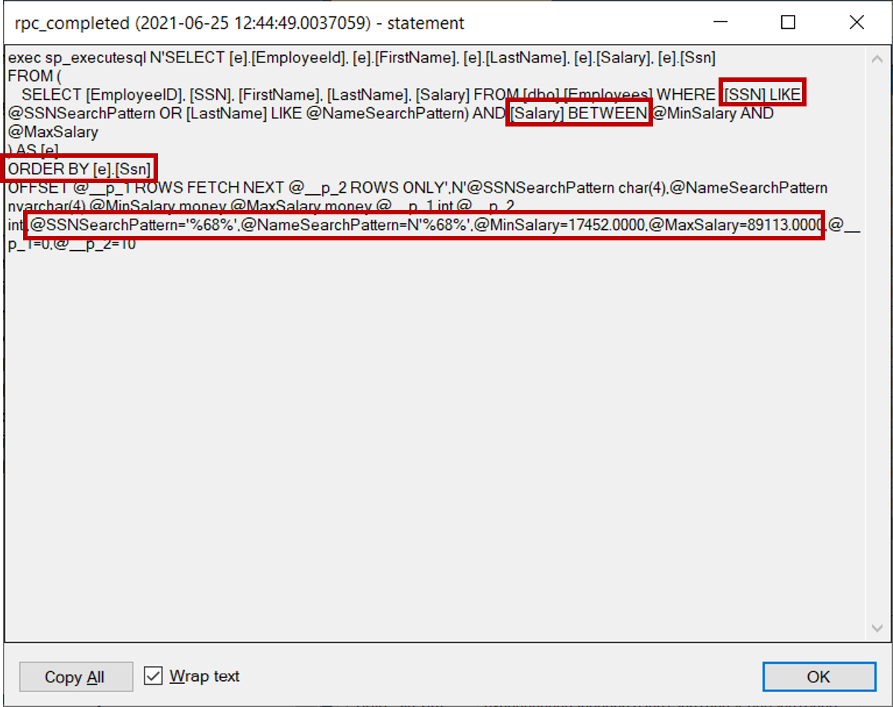
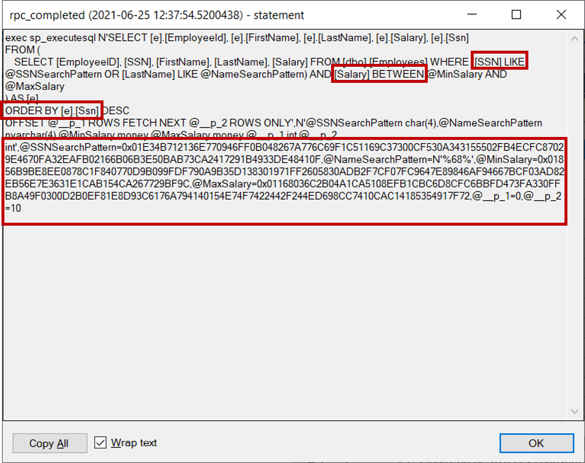

# Always Encrypted with secure enclaves in SQL Server with Host Guardian Service - Demos

The demos in this folder showcase [Always Encrypted with secure enclaves](https://docs.microsoft.com/azure/azure-sql/database/always-encrypted-with-secure-enclaves-landing) in SQL Server. The demos use the Contoso HR web application and Host Guardian Service for attesting an enclave within the SQL Server instance.

### Contents

[About this sample](#about-this-sample)<br/>
[Before you begin](#before-you-begin)<br/>
[Setup](#setup)<br/>
[Prepare for the demo](#prepare-for-the-demo)<br/>
[Demo steps](#demo-steps)<br/>
[Key takeaways](#key-takeaways)<br/>
[Reset the demo](#reset-the-demo)<br/>

## About this sample

- **Applies to:** SQL Server 2019 or later
- **Key features:** Always Encrypted with secure enclaves
- **Workload:** Human resources (HR) application
- **Programming Language:** C#, Transact-SQL
- **Authors:** Jakub Szymaszek
- **Update history:**

## Before you begin

You need two machines (they can be virtual machines):

- The SQL Server computer, which must meet the [SQL Server computer requirements](https://docs.microsoft.com/sql/relational-databases/security/tutorial-getting-started-with-always-encrypted-enclaves?#sql-server-computer-requirements). In addition, you will need to install Visual Studio 2019 or later, to compile and run the sample web application.
- The HGS computer to host Windows Host Guardian Service for enclave attestation. See [HGS computer requirements](https://docs.microsoft.com/sql/relational-databases/security/tutorial-getting-started-with-always-encrypted-enclaves#hgs-computer-requirements) for details.

## Setup

This section describes the initial setup steps.

1. Configure host attestation for the SQL Server computer, following Steps 1-2 in [Tutorial: Getting started with Always Encrypted with secure enclaves using SSMS](https://docs.microsoft.com/sql/relational-databases/security/tutorial-getting-started-with-always-encrypted-enclaves#step-1-configure-the-hgs-computer).
1. Enable Always Encrypted with secure enclaves in your SQL Server instances by following instructions in Step 3 in [Tutorial: Getting started with Always Encrypted with secure enclaves using SSMS](https://docs.microsoft.com/en-us/sql/relational-databases/security/tutorial-getting-started-with-always-encrypted-enclaves#step-3-enable-always-encrypted-with-secure-enclaves-in-sql-server).
1. Import the **ContosoHR** demo database.
   1. Clone/Download the repository.
   1. Open SSMS and connect to your SQL Server instance.
   1. In SSMS, right-click on **Databases** in Object Explorer and select **Import Data-tier Application...**.
   1. Locate the **ContosoHR** bacpac file the **/setup** folder.
   1. Complete the steps of the wizard to import the **ContosoHR** database.
1. Configure the Contoso HR web application
   1. Start Visual Studio and open the **ContosoHR** solution file located in **../source**.
   1. Using Solution Explorer, locate and open the **appsettings.json** file under the **ContosoHR** project.
   1. Look for the line that contains the database connection string for the web application. The line should look like this:

    ```json
    "ContosoHRDatabase": "Data Source=.;Initial Catalog=ContosoHR;Column Encryption Setting=Enabled;Attestation Protocol=HGS;Enclave Attestation Url=http://<your HGS computer>/Attestation;Integrated Security=true"
    ```

   1. Make sure the value of the **Data Source** keyword in the database connection string correctly identifies your SQL Server instance.
   1. Replace **\<your HGS computer\>** with a DNS name or an IP address of your HGS computer.
   1. Save the file.

1. In Visual Studio, select **Build**>**Build Solution** to build the demo application.

## Prepare for the demo

This section describes the steps you should execute before each demo presentation.

During the demo, you will use two instances of SSMS:

- DBA's instance - when using it, you will assume the role of a DBA.
- Security Administrator's instance - when using it, you will assume the role of a Security Administrator, who configures Always Encrypted in the database.

Perform the below steps before you show the demo.

1. Close all running SSMS instances.
1. Prepare DBA's instance of SSMS.
   1. Start SSMS.
   1. In the **Connect to Server** dialog:
      1. In the main page of the dialog, enter your database server name. For example, enter `.` to connect to the default instance on the local machine. Set your authentication parameters.
      1. Click the **Options >>** button, select the **Connection Properties** tab and enter the database name (**ContosoHR**).

         

      1. Select the **Always Encrypted** tab. Make sure the **Enable Always Encrypted** checkbox is **not** selected.

         

      1. Click Connect.
   1. Configure an extended event session to intercept application's queries.
      1. Click Ctrl + O. In the **Open File** dialog, navigate to the **tsql-scripts** folder and select ***CreateXESession.sql**. Click **F5** to execute the query.
      1. In Object Explorer, locate the newly created **Demo** extended event session - under your server, go to **Management/Extended Events/Sessions**.
      1. Righ-click the **Demo** session and select **Watch Live Data**. This will open the **Demo Live Data** window.

        

      1. Close the tab with the ***CreateXESession.sql** query.
   1. Prepare the query windows for the demo.
      1. With the **ContosoHR** database selected in Object Explorer, click Ctrl + O. In the **Open File** dialog, navigate to the **tsql-scripts** folder and select **ListAllEmployees.sql**. Do not execute the query yet.
      1. With the **ContosoHR** database selected, click Ctrl + O. In the **Open File** dialog, navigate to the **tsql-scripts** folder and select **QueryEvents.sql**. Do not execute the query yet.
1. Prepare Security Administrator's instance of SSMS.
   1. Start SSMS.
   1. In the **Connect to Server** dialog:
      1. In the main page of the dialog, enter your database server name. For example, enter `.` to connect to the default instance on the local machine. Set your authentication parameters.
      1. Click the **Options >>** button, select the **Connection Properties** tab and enter the database name (**ContosoHR**).

        

      1. Select the **Always Encrypted** tab. Make sure the **Enable Always Encrypted** checkbox **is** selected. Enter your attestation URL.

        

      1. Click Connect.
   1. Configure query windows.
      1. In Object Explorer, find and select the **ContosoHR** database.

         

      1. With the **ContosoHR** database selected, click Ctrl + O. In the **Open File** dialog, navigate to the **tsql-scripts** folder and select **EncryptColumns.sql**. Do not execute the query yet.
1. Run the web application
   1. Open the **ContosoHR** solution, located in **../source**, in Visual Studio.
   1. Click **F5** to run the solution. The Contoso HR web application should open in a browser window.

       

## Demo steps

1. Show the Contoso HR web app in the browser. This application displays employee records and allows you to filter employees by salary or by a portion of the social security number (SSN). Move the salary slider and enter a couple of digits in the search box to filter by salary and SSN. You can also click on the **Ssn** or **Salary** headers to sort by SSN or salary.

   

1. Switch to DBA's instance of SSMS, select the **ListAllEmployees.sql** tab and click **F5** to execute the query, which shows the content of the **Employees** table, the web application uses as a data store. As a DBA, you can view all sensitive information about employees, including the data stored in the **SSN** and **Salary** columns. A malicious DBA could easily exfiltrate the data by running a simple query like this one.

   

1. Inspect the queries the demo application has sent to the database.
   1. Select the **Demo Live Data** window, which should contain a table with some events your demo application triggered.
   1. If the table does not contain the **statement** column, right click on the header of the table and select **Choose Columns...**. Move **statement** to **Selected columns** and click **OK**.

      

   1. Double click on the statement column in the last row of the table to see the last query the application sent to the database. Inspect the query statement. Note that the query contains the **WHERE** clause with rich computations on encrypted columns: pattern matching using the **LIKE** predicate on the **SSN** column and the range comparison on the **Salary** column. The query also sorts records (the **ORDER BY** clause) by **SSN** or **Salary**.
   1. Locate the value of query parameters: **@SSNSearchPattern**, **@MinSalary**, **@MaxSalary**. Note that the values of the parameters are in plaintext, as the columns, the parameters correspond  to, are not encrypted.

     

   1. Click **OK** to close the statement window.

1. As a Security Administrator, provision a column master key for Always Encrypted.
   1. In Object Explorer of the Security Administrator's instance of SSMS, expand the node of the **ContosoHR** database and navigate to **Security/ Always Encrypted Keys/Column Master Keys**.  
   1. Right-click on the **Column Master Keys** folder and select **New Column Master Key…**.
      
   1. Enter a column master key name: **CMK1**.
   1. Select **Windows Certificate Store - Current User**.
   1. Make sure **Allow enclave computations** is selected.  
      
   1. Click **Generate Certificate** to create a new certificate to be used as a column master key.
   1. Click **OK**.
1. As a Security Administrator, provision a column encryption key for Always Encrypted.
   1. In Object Explorer of the Security Administrator's instance of SSMS, expand the node of the **ContosoHR** database and navigate to **Security/ Always Encrypted Keys/Column Encryption Keys**.
   1. Right-click on the **Column Encryption Keys** folder and select **New Column Encryption Key…**.
   1. Enter a column encryption key name: **CEK1**.
   1. Select **CMK1** as the column master key to protect your new column encryption key.
   1. Click **OK**.
1. As a Security Administrator, encrypt the **SSN** and **Salary** columns in place, using the secure enclave.
    1. In Security Administrator's instance of SSMS, select the **EncryptColumns.sql** tab and click **F5** to execute the query.
1. Switch back to DBA's instance of SSMS, select the **ListAllEmployees.sql** tab and click **F5** to execute the query again. Now the query should show the encrypted data in the **SSN** and **Salary** columns. As both columns are encrypted, the DBA cannot see the data in plaintext. 

   

1. In the web browser containing the web app, move the slider to reset the filter for salary and then re-enter a few digits of an SSN. Confirm the application still can filter employee records by salary and SSN.

1. Inspect the queries the demo application sends to the database, after encrypting the columns.
   1. In DBA's instance of SSMS, select the **Demo Live Data** window, which should contain a table with some events your demo application triggered.

   1. Double click on the statement column in the last row of the table to see the last query the application sent to the database. Inspect the query statement. Note that the query statement the query sends to the database has not changed - it still contains pattern matching using the **LIKE** predicate on the **SSN** column and the range comparison on the **Salary** column, as well as sorting  (the **ORDER BY** clause) by **SSN** or **Salary**. 
   1. Locate the value of query parameters: **@SSNSearchPattern**, **@MinSalary**, **@MaxSalary**. Note that the values of the parameters are now encrypted – the client driver inside the web app transparently encrypts parameters corresponding to encrypted columns, before sending the query to the database. Not only does not the DBA have access to sensitive data in the database, but the DBA cannot see the plaintext values of query parameters used to process that data either.

     

   1. Click **OK** to close the statement window.

## Key takeaways

Secure enclaves make it possible to encrypt sensitive data columns in-place, eliminating a need to move the data outside of the database for cryptographic operations.

The unique benefit of Always Encrypted with secure enclaves is that it allows you to protect your sensitive data from high-privilege users, including DBAs in your organization, and, after you encrypt your data to protect it, your applications can continue running rich queries on encrypted columns.

## Reset the demo

In Security Administrator's instance of SSMS:

1. Open and execute **tsql-scripts/DecryptColumns.sql**. 
1. Open and execute **tsql-scripts/DropKeys.sql**. 
1. Close both SSMS windows.
