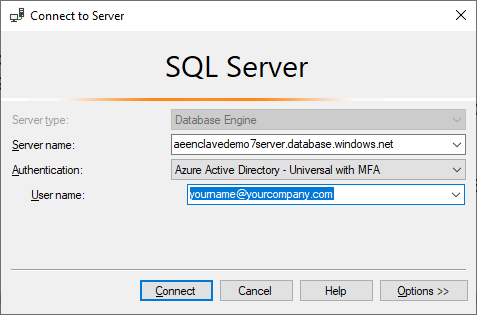
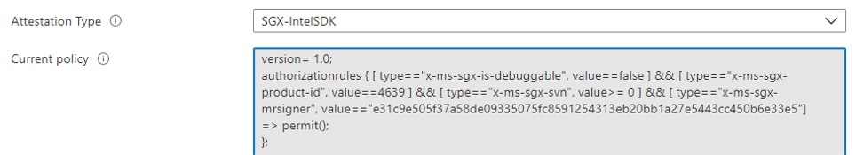
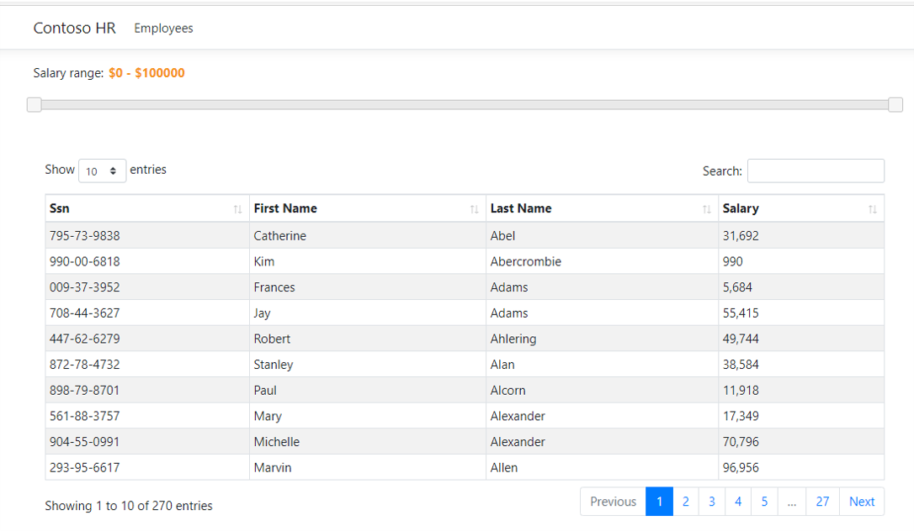
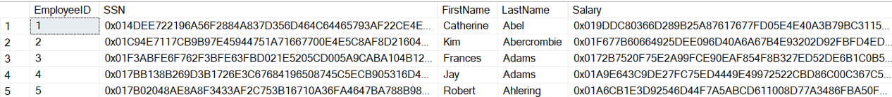
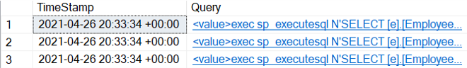
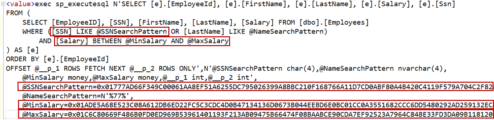
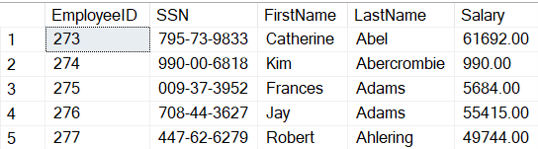
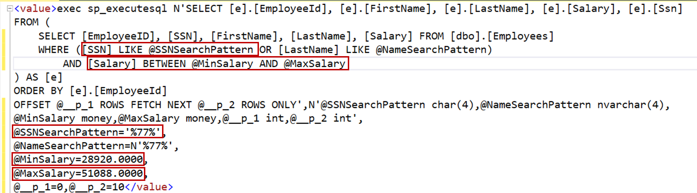

# Always Encrypted with secure enclaves in Azure SQL Database - Demos

The below demos showcase [Always Encrypted with secure enclaves](https://docs.microsoft.com/azure/azure-sql/database/always-encrypted-with-secure-enclaves-landing) in Azure SQL Database.

## Contents

1. [Prerequisites](#Prerequisites)
2. [Demo 1](#demo-1) - a tour of the demo environment.
3. [Demo 2](#demo-2) - a short demo of key benefits of secure enclaves.
4. [Demo 3](#demo-3) - a longer demo showcasing in-place encryption and rich queries.

## Prerequisites

The demos assume you have met the prerequisites listed in [Prerequisites](../README.md#prerequisites) and you have set up your demo environment by following the instructions in [Setup](../README.md#setup). Make sure you have the information about your environment, the setup script has produced:

- The demo resource group name (`<project name>`).
- The database server name (`<project name>server.database.windows.net`).
- The database name (`ContosoHR`).
- The attestation URL (`https://<project name>attest.<region moniker>.attest.azure.net/attest/SgxEnclave`).
- The application URL (`https://<project name>app.azurewebsites.net/`).

## Demo 1

During this demo, you will take a tour of the demo environment, in which Always Encrypted with secure enclaves is already set up and sensitive data columns in the database are already encrypted.

### Prepare for the demo
Perform the below steps before you show the demo.

1. Close all running instances of SQL Server Management Studio (SSMS).
2. Prepare a new instance of SSMS.
    1. Start SSMS.
    2. In the Connect to Server dialog:
        1. In the main page of the dialog, enter your database server name. Set `Authentication` to `Azure Active Directory – Universal with MFA`. In the `User Name` field, enter your Azure AD username. You should enter the same username, you've used to sign in to Azure, when you set up your demo environment.

           

        2. Click Connect.
        3. When prompted, sign in to Azure.
3. Prepare your web browser.
    1. Open a new tab in the browser and point it to Azure Portal: `https://portal.azure.com`.
    2. Sign in to Azure if prompted.
    3. In the `Search` box in the Azure Portal, enter the name of your demo resource group and click `Enter`. In the search results, click on your resource group. You should see the content of your resource group, which should look like this:

       

### Demos steps

1. Review the content of your demo resource group. It should contain the following resources:

    - `<project name>app`- the app service hosting the Contoso HR web application.
    - `<project name>attest`- the attestation provider in Microsoft Azure Attestation for attesting the secure enclave for the `ContosoHR` database.
    - `<project name>identity` - the user-assigned managed identity that was used to deploy the web application.
    - `<project name>plan` - the app service plan for the web application.
    - `<project name>server`- the Azure SQL database server in Azure SQL Database.
    - `<project name>vault` - the key vault in Azure Key Vault, containing the column master key for Always Encrypted.
    - `ContosoHR` - the database.
   
2. Right-click on the `ContosoHR` database in the resource group and open its `Overview` blade in the new tab. Click on `Compute + storage` under `Settings`.  Click `Change configuration`. Note that the database is already configured to use the DC-series hardware configuration that supports confidential computing using secure enclaves. Setting the DC-series hardware configuration for a database is required to use Always Encrypted with secure enclaves in the database. For more information, see [Enable Intel SGX for your Azure SQL Database](https://docs.microsoft.com/en-us/azure/azure-sql/database/always-encrypted-enclaves-enable-sgx).

   

3. Close the browser tab for the database. Right-click on the attestation provider in your resource group and open its `Overview` blade in a new tab. Click on `Policy` under `Settings`. Select `SGX-IntelSDK` for `Attestation Type`. This will display the attestation policy configured for Intel Software Guard eXtensions (Intel SGX) enclaves. The policy allows a client driver within an application to verify the secure enclave in Azure SQL Database is a genuine Intel SGX enclave and it runs the genuine SQL library that implements Transact-SQL predicates and cryptographic operations of Always Encrypted. For more information, see [Configure Azure Attestation for your Azure SQL logical server](https://docs.microsoft.com/en-us/azure/azure-sql/database/always-encrypted-enclaves-configure-attestation).

   

4. Close the browser tab for the attestation provider. Right-click on the app service for the Contoso HR web application in your resource group and open its `Overview` blade in a new tab. Click on `Configuration` under `Settings`. In the `Connection strings` section, click `Advanced edit`. This will display the database connection string configured for the web application. There are three important things to call out in the database connection string:

   - `Column Encryption Setting = Enabled` turns the Always Encrypted on in the client driver, allowing it to transparently encrypt query parameters and decrypt queries results.
   - `Attestation Protocol = AAS` specifies Microsoft Azure Attestation is used for attesting the secure enclave for the `ContosoHR` database.
   - `Enclave Attestation Url` specifies the URL of the attestation policy in your attestation provider in Microsoft Azure Attestation.

   

5. Close the browser tab for the app service. Right-click on the key vault in your resource group open its `Overview` blade in a new tab. 
    1. Click on `Keys` under `Settings`. You should see the entry for the key, named `CMK` - this is your column master key for Always Encrypted.
       

    2. Click on `Access Policies` under `Settings`. You should see two access policy entries: one for your identity and one for the web app's identity. These policies grant you permissions necessary to perform key management operations and they grant the web app permissions required to decrypt column encryption keys, protecting the data.

6. Switch to SSMS.
    1. In Object Explorer, navigate to the `ContosoHR` database. Then go to `Security` > `Always Encrypted Keys`.
    2. Open the `Column Master Keys` and `Column Encryption Keys` folders. You should see the metadata object, named `CMK1`, for the column master key and the metadata object, named `CEK1`, for the column encryption key.
    3. Right click on `CMK1` and select `Properties`. Note that the metadata object references the key in the key vault. Also note `Enclave Computations` is set to `Allowed`, which permits the column encryption key, this columns master key protects, to be used in enclave computations.

       

### Key Takeaways

Always Encrypted with secure enclaves requires specific hardware that is exposed in Azure SQL Database as the DC-series hardware configuration. Microsoft Azure Attestation is a Platform-as-a-Service solution for attestation enclaves in Azure. Enclaves are attested against a policy, you define and control.

## Demo 2

This short demo highlights the main benefits of Always Encrypted with secure enclaves. The starting point for the demo is the ContosoHR database the `SSN` and `Salary` columns already encrypted.

### Prepare for the demo
Perform the below steps before you show the demo.

1. Close all running instances of SQL Server Management Studio (SSMS).
2. Prepare a new instance of SSMS.
    1. Start SSMS.
    2. In the `Connect to Server` dialog:
        1. In the main page of the dialog, enter your database server name. Set `Authentication` to `Azure Active Directory – Universal with MFA`. In the `User Name` field, enter your Azure AD username. You should enter the same username, you've used to sign in to Azure, when you set up your demo environment.

            

        2. Click the `Options >>` button, select the `Connection Properties` tab and enter the database name (`ContosoHR`).

           

        3. Select the `Always Encrypted` tab. Make sure the `Enable Always Encrypted` checkbox is **not** selected.

           

        4. Click Connect.
        5. When prompted, sign in to Azure.
    3. Configure query windows.
        1. In Object Explorer, find and select the `ContosoHR` database.

          

        2. With the `ContosoHR` database selected, click Ctrl + O. In the `Open File` dialog, navigate to the `tsql-scripts` folder and select `ListAllEmployees.sql`. Do not execute the query yet.
        3. With the `ContosoHR` database selected, click Ctrl + O. In the `Open File` dialog, navigate to the `tsql-scripts` folder and select `QueryEvents.sql`. Do not execute the query yet.
3. Prepare your web browser.
    1. Open your browser.
    2. Point the browser to the demo application URL.

       

### Demos steps

1. Show the Contoso HR web app in the the browser. This application displays employee records and allows you to filter employees by salary or by a portion of the social security number (SSN). Move the salary slider and enter a couple of digits in the search box to filter by salary and SSN.

   

2. Switch to SSMS, select the `ListAllEmployees.sql` tab and click `F5` to execute the query, which shows the content of the `Employees` table, the web application uses as a data store. Although you are a DBA of the database, you cannot see the plaintext data in the `SSN` and `Salary` columns, as those two columns are protected with Always Encrypted.

   

3. Select the `QueryXevents.sql` tab and click `F5` to execute the query. This query retrieves extended events from the `Demo` extended event session, configured in the `ContosoHR` database. Each extended event captures a query the web application has sent to the database.

   

4. Click on the link in the second column of the first row of the result set to see the extended event with the latest query from the application. This will open the extended event in the new tab.
    1. Review the query statement. Note that the query contains the `WHERE` clause with rich computations on encrypted columns: pattern matching using the `LIKE` predicate on the `SSN` column and the range comparison on the `Salary` column. The query also sorts records (the `ORDER BY` clause) by `SSN` or `Salary`. **Pro Tip:** to make it easier to view the query statement, you can put line brakes in it. 

   

    2. Locate the value of query parameters: `@SSNSearchPattern`, `@MinSalary`, `@MaxSalary`. Note that the values of the parameters are encrypted – the client driver inside the web app transparently encrypts parameters corresponding to encrypted columns, before sending the query to the database. Not only does not the DBA have access to sensitive data in the database, but the DBA cannot see the plaintext values of query parameters used to process that data.

### Key Takeaways

Always Encrypted with secure enclaves allows applications to perform rich queries on sensitive data without revealing the data to potentially malicious insiders, including DBAs in your organization.

## Demo 3

The starting point for this demo is the database with no columns encrypted - the data is initially not protected. The demo shows how to reach the following two objectives:

1. Protect sensitive data in the database by encrypting it in-place.
2. Ensure the Contoso HR web application can continue run rich queries on database columns after encrypting the columns.

During the demo, you will use two instances of SQL Server Management Studio (SSMS):

- DBA's instance - when using it, you will assume the role of a DBA.
- Security Adminsitrator's instance - when using it, you will assume the role of a Security Administrator, who configures Always Encrypted in the database.

### Prepare for the demo
Perform the below steps before you show the demo.

1. Close all running SSMS instances.
2. Prepare DBA's instance of SSMS.
    1. Start SSMS.
    2. In the Connect to Server dialog:
        1. In the main page of the dialog, enter your database server name. Set `Authentication` to `Azure Active Directory – Universal with MFA`. In the `User Name` field, enter your Azure AD username. You should enter the same username, you've used to sign in to Azure, when you set up your demo environment.

           

        2. Click the `Options >>` button, select the `Connection Properties` tab and enter the database name(`ContosoHR`).

           

        3. Select the `Always Encrypted` tab. Make sure the `Enable Always Encrypted` checkbox is **not** selected.

           

        4. Click Connect.
        5. When prompted, sign in to Azure.
    3. Configure query windows.
        1. In Object Explorer, find and select the `ContosoHR` database.

          

        2. With the `ContosoHR` database selected, click Ctrl + O. In the `Open File` dialog, navigate to the `tsql-scripts` folder and select `ListAllEmployees.sql`. Do not execute the query yet.
        3. With the `ContosoHR` database selected, click Ctrl + O. In the `Open File` dialog, navigate to the `tsql-scripts` folder and select `QueryEvents.sql`. Do not execute the query yet.
3. Prepare Security Administrator's instance of SSMS.
    1. Start SSMS.
    2. In the Connect to Server dialog:
        1. In the main page of the dialog, enter your database server name. Set `Authentication` to `Azure Active Directory – Universal with MFA`. In the `User Name` field, enter your Azure AD username. You should enter the same username, you've used to sign in to Azure, when you set up your demo environment.

           

        2. Click the `Options >>` button, select the `Connection Properties` tab and enter the database name(`ContosoHR`).

           

        3. Select the `Always Encrypted` tab. Make sure the `Enable Always Encrypted` checkbox **is** selected. Enter your attestation URL.

           

        4. Click Connect.
        5. When prompted, sign in to Azure.
    3. Configure query windows.
        1. In Object Explorer, find and select the `ContosoHR` database.

          

        2. With the `ContosoHR` database selected, click Ctrl + O. In the `Open File` dialog, navigate to the `tsql-scripts` folder and select `DecryptColumns.sql`. **Click `F5` to execute the query**, which will decrypt the `SSN` and `Salary` columns in the database.
        3. With the `ContosoHR` database selected, click Ctrl + O. In the `Open File` dialog, navigate to the `tsql-scripts` folder and select `EncryptColumns.sql`. Do not execute the query yet.
4. Prepare your web browser.
    1. Open your browser.
    2. Point the browser to the demo application URL.

       

### Demos steps

1. Show the Contoso HR web app in the the browser. This application displays employee records and allows you to filter employees by salary or by a portion of the social security number (SSN). Move the salary slider and enter a couple of digits in the search box to filter by salary and SSN.

   

2. Switch to DBA's instance of SSMS, select the `ListAllEmployees.sql` tab and click `F5` to execute the query, which shows the content of the `Employees` table, the web application uses as a data store. As a DBA, you can view all sensitive information about employees, including the data stored in the `SSN` and `Salary` columns. A malicious DBA could easily exfiltrate the data by running a simple query like this one.

   

3. Select the `QueryXevents.sql` tab and click `F5` to execute the query. This query retrieves extended events from the `Demo` extended event session, configured in the `ContosoHR` database. Each extended event captures a query the web application has sent to the database.

   

4. Click on the link in the second column of the first row of the result set to see the extended event with the latest query from the application. This will open the extended event in the new tab.
    1. Review the query statement. Note that the query contains the `WHERE` clause with rich computations on encrypted columns: pattern matching using the `LIKE` predicate on the `SSN` column and the range comparison on the `Salary` column. The query also sorts records (the `ORDER BY` clause) by `SSN` or `Salary`. **Pro Tip:** to make it easier to view the query statement, you can put line brakes in it.

   

    2. Locate the value of query parameters: `@SSNSearchPattern`, `@MinSalary`, `@MaxSalary`. Note that the values of the parameters are in plaintext, as the columns, the parameters correspond  to, are not encrypted.

5. Switch to Security Administrator's instance of SSMS, select the `EncryptColumns.sql` tab and click `F5` to execute the query, encrypts the data in the `SSN` and `Salary` columns in place, using the secure enclave.

6. Switch back to DBA's instance of SSMS, select the `ListAllEmployees.sql` tab and click `F5` to execute the query again. Now the query should show the encrypted data in the `SSN` and `Salary` columns. As both columns are encrypted, the DBA cannot see the data in plaintext. 

   

7. In the web browser, move the slider to reset the filter for salary and then re-enter a few digits of an SSN. Confirm the application still can filter employee records by salary and SSN.

8. Switch to DBA's instance of SSMS, select the `QueryXevents.sql` tab and click `F5` to re-run the query. 

9. Click on the link in the second column of the first row of the result set to see the extended event with the latest query from the application. This will open the extended event in the new tab.
    1. Review the query statement. Note that the query statement the query sends to the database has not changed - it still contains pattern matching using the `LIKE` predicate on the `SSN` column and the range comparison on the `Salary` column, as well as sorting  (the `ORDER BY` clause) by `SSN` or `Salary`. **Pro Tip:** to make it easier to view the query statement, you can put line brakes in it.

   

    2. Locate the value of query parameters: `@SSNSearchPattern`, `@MinSalary`, `@MaxSalary`. Note that the values of the parameters are now encrypted – the client driver inside the web app transparently encrypts parameters corresponding to encrypted columns, before sending the query to the database. Not only does not the DBA have access to sensitive data in the database, but the DBA cannot see the plaintext values of query parameters used to process that data.

### Key Takeaways

Secure enclaves make it possible to encrypt sensitive data columns in-place, eliminating a need to move the data outside of the database for cryptographic operations.

The unique benefit of Always Encrypted with secure enclaves is that it allows you to protect your sensitive data from high-privilege users, including DBAs in your organization, and, after you encrypt your data to protect it, your applications can continue running rich queries on encrypted columns.
